# CS 3410: Database Project

- **Client:** TheGenericGameStore
- **Team Members:** Jackson Hainey, Ryan Woods
- **University:** Kennesaw State University
- **Course:** CS 3410: Introduction to Database Systems, Spring 2026
- **Instructor:** Dr. North

The full submitted document (with all original formatting) is located at [`Project_Submission.docx`](./Project_Submission.docx). The Microsoft Access database itself is included as [`CS3410Assignment5GroupProj1.accdb`](./CS3410Assignment5GroupProj1.accdb).

------

## Table of Contents

1. [Executive Summary](#executive-summary)
2. [ER Diagram](#er-diagram)
3. [Relational Schema](#relational-schema)
4. [CRUD Matrix](#crud-matrix)
5. [Data Dictionary](#data-dictionary)
6. [Table Descriptions](#table-descriptions)
7. [Database Tables (Access Screenshots with Data)](#database-tables-access-screenshots-with-data)
8. [Design Tables (Access Design View Screenshots)](#design-tables-access-design-view-screenshots)
9. [Forms and Queries](#forms-and-queries)
10. [References](#references)

------

## Executive Summary

TheGenericGameStore needs a relational database to replace its current system for inventory, sales, and customer records. The project builds a database to manage game inventory (titles, platform, price, stock), record sales with payment methods, and track customer profiles. The database uses IE Crow's Foot ER notation in Microsoft Access, with tables like Game, Customer, Transaction, and ReceiptDetail linked via keys. A data dictionary and CRUD matrix define data roles, and Access queries/forms support tasks like recording sales and checking inventory.

The system will be used by Store Staff (Sales Associates and Inventory Managers), who will manage day-to-day tasks like updating stock levels, processing sales, and recording payments. Store Owners/Managers will oversee the system by generating reports, monitoring inventory, and analyzing customer trends. Customers, while not direct users, will benefit from accurate inventory tracking, faster checkout processes, and purchase history visibility. The project includes a data dictionary, CRUD matrix, and SQL queries to ensure data consistency and efficient operations.

------

## ER Diagram

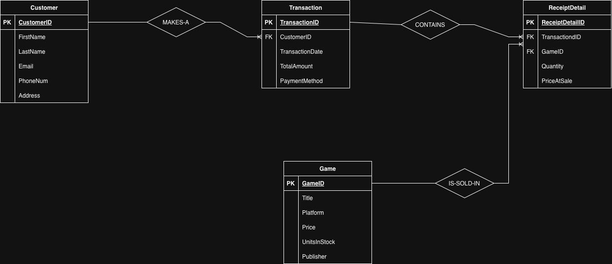

------

## Relational Schema

```
Customer (
    CustomerID (PK)
    FirstName
    LastName
    Email
    PhoneNum
    Address
)

Transaction (
    TransactionID (PK)
    CustomerID (FK)
    TransactionDate
    TotalAmount
    PaymentMethod
)

Game (
    GameID (PK)
    Title
    Platform
    Price
    UnitsInStock
    Publisher
)

ReceiptDetail (
    ReceiptDetailID (PK)
    TransactionID (FK)
    GameID (FK)
    Quantity
    PriceAtSale
)
```

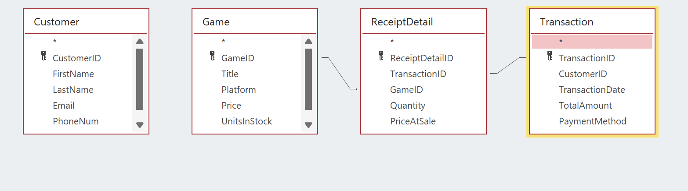

------

## CRUD Matrix

|               | Customer | Transaction | Game | ReceiptDetail |
| ------------- | -------- | ----------- | ---- | ------------- |
| Customer      | CRUD     | R           |      |               |
| Transaction   | R        | CRUD        | R    | CR            |
| Game          |          |             | CRUD |               |
| ReceiptDetail |          | R           | R    | CRUD          |

See also [`CRUD MATRIX.docx`](./CRUD%20MATRIX.docx) for the original document.

------

## Data Dictionary

| Attribute       | Table         | Required | Unique | FK | PK | Reference Table | Data Type  |
| --------------- | ------------- | -------- | ------ | -- | -- | --------------- | ---------- |
| CustomerID      | Customer      | Y        | Y      | N  | Y  | NF              | AutoNumber |
| FirstName       | Customer      | Y        | N      | N  | N  | NF              | Short Text |
| LastName        | Customer      | Y        | N      | N  | N  | NF              | Short Text |
| Email           | Customer      | N        | N      | N  | N  | NF              | Short Text |
| PhoneNum        | Customer      | N        | N      | N  | N  | NF              | Short Text |
| Address         | Customer      | Y        | N      | N  | N  | NF              | Short Text |
| TransactionID   | Transaction   | Y        | Y      | N  | Y  | NF              | AutoNumber |
| CustomerID      | Transaction   | Y        | N      | Y  | N  | Customer        | Number     |
| TransactionDate | Transaction   | Y        | N      | N  | N  | NF              | Date/Time  |
| TotalAmount     | Transaction   | Y        | N      | N  | N  | NF              | Currency   |
| PaymentMethod   | Transaction   | Y        | N      | N  | N  | NF              | Short Text |
| GameID          | Game          | Y        | Y      | N  | Y  | NF              | AutoNumber |
| Title           | Game          | Y        | N      | N  | N  | NF              | Short Text |
| Platform        | Game          | Y        | N      | N  | N  | NF              | Short Text |
| Price           | Game          | Y        | N      | N  | N  | NF              | Currency   |
| UnitsInStock    | Game          | Y        | N      | N  | N  | NF              | Number     |
| Publisher       | Game          | Y        | N      | N  | N  | NF              | Short Text |
| ReceiptDetailID | ReceiptDetail | Y        | Y      | N  | Y  | NF              | AutoNumber |
| TransactionID   | ReceiptDetail | Y        | N      | Y  | N  | Transaction     | Number     |
| GameID          | ReceiptDetail | Y        | N      | Y  | N  | Game            | Number     |
| Quantity        | ReceiptDetail | Y        | N      | N  | N  | NF              | Number     |
| PriceAtSale     | ReceiptDetail | Y        | N      | N  | N  | NF              | Currency   |

------

## Table Descriptions

- **Customer:** Stores customer profiles, including FirstName, LastName, Email, PhoneNum, and Address.
- **Transaction:** Records sales data, including TransactionID, CustomerID, PaymentMethod, TransactionDate, and TotalAmount.
- **Game:** Tracks game inventory, including Title, Platform, Price, UnitsInStock, and Publisher.
- **ReceiptDetail:** Links games to transactions, recording Quantity and PriceAtSale.

------

## Database Tables (Access Screenshots with Data)

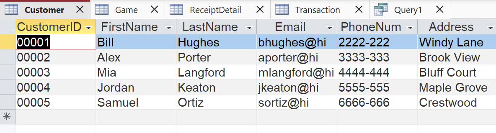
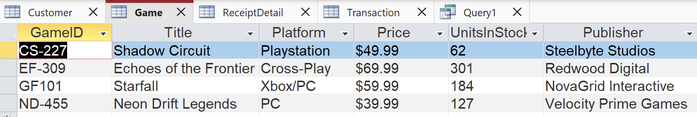

------

## Design Tables (Access Design View Screenshots)

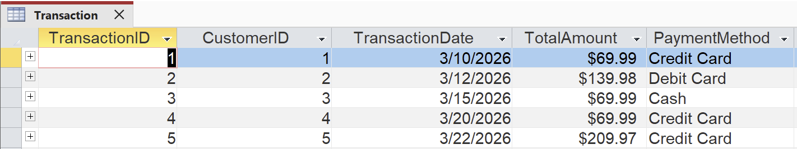
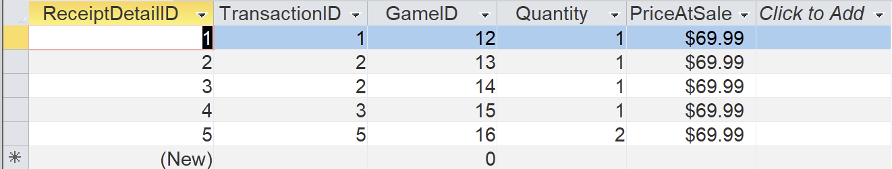
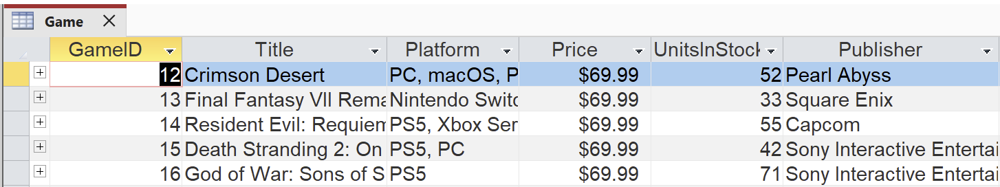
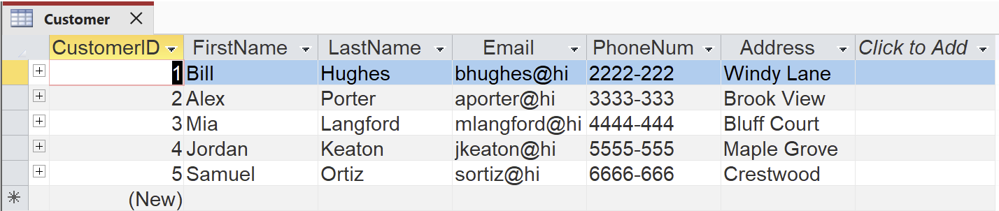
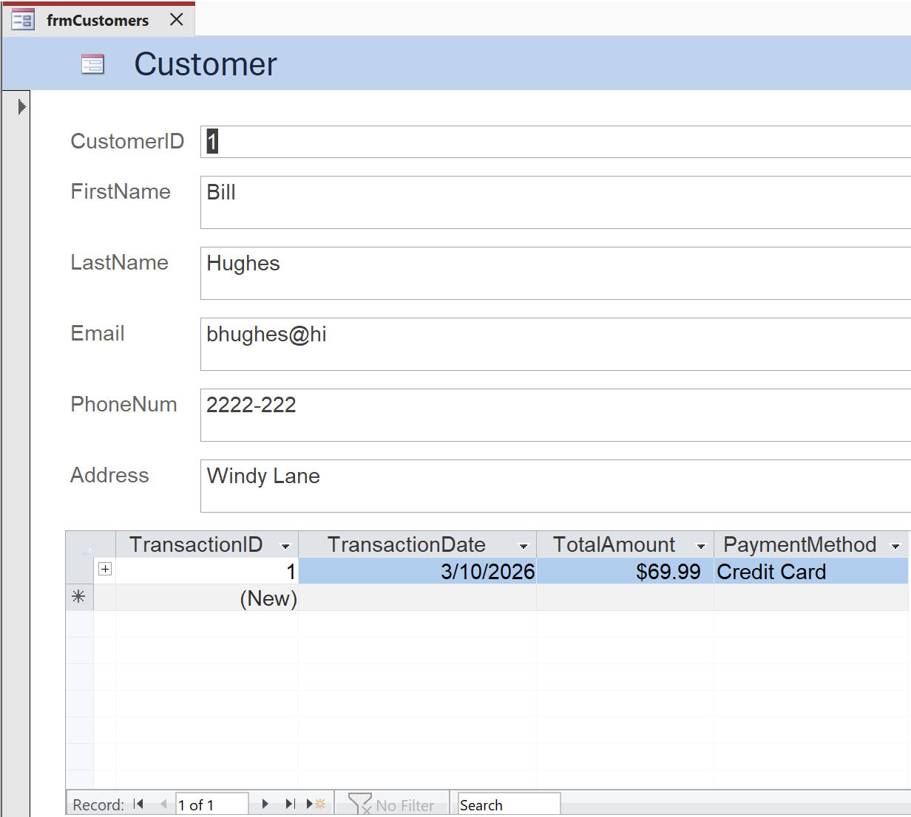
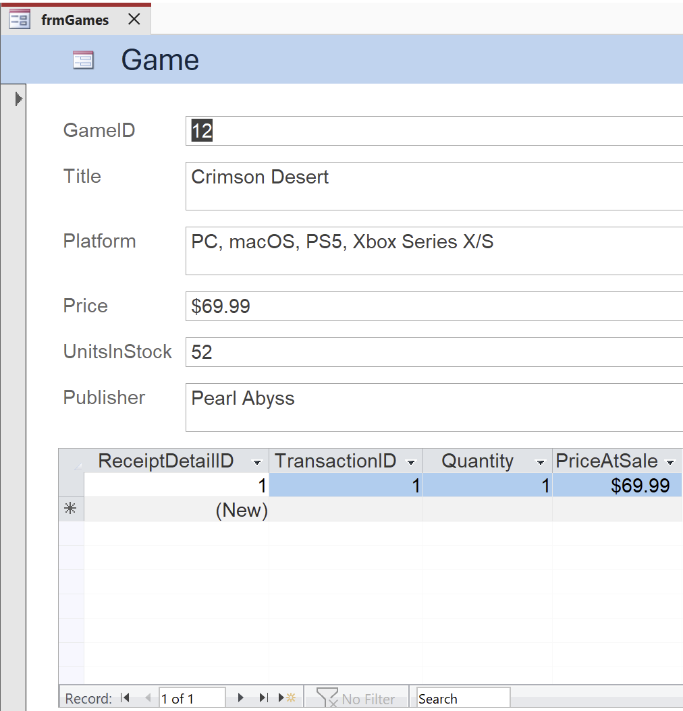
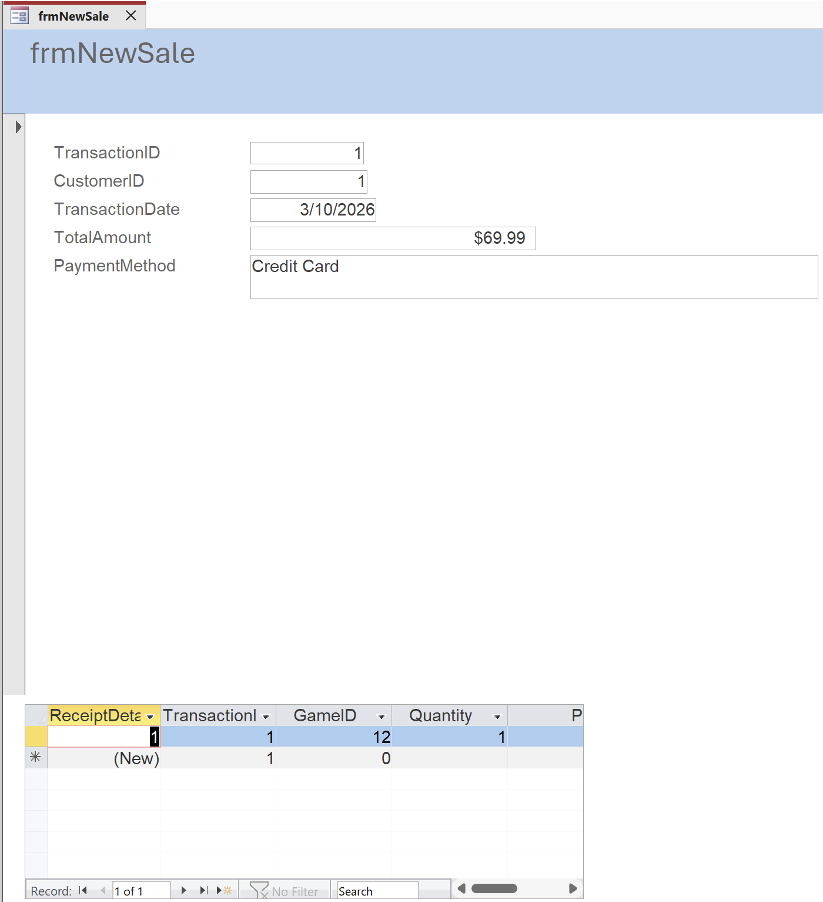

------

## Forms and Queries

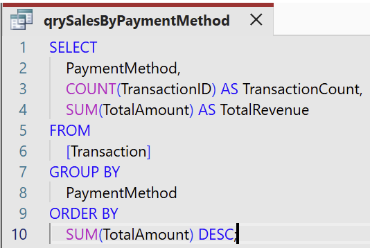
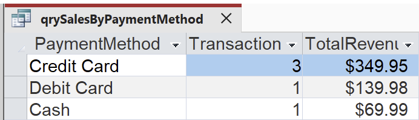
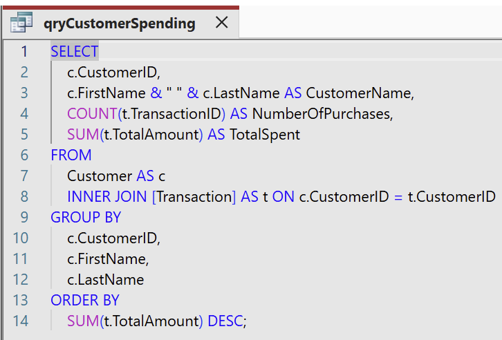
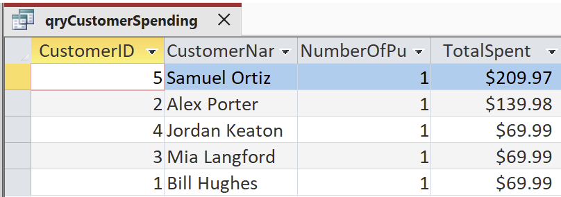
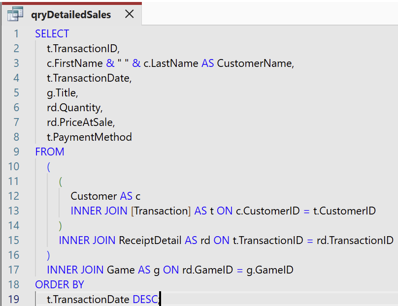
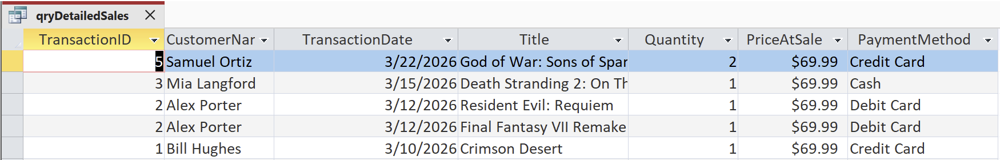
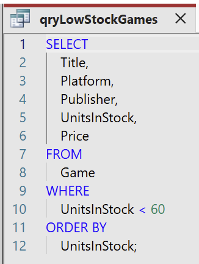
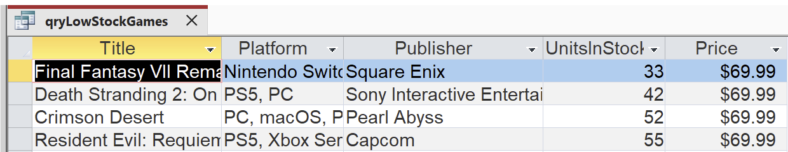

------

## References

Kroenke, D. M., Auer, D. J., Vandenberg, S. L., & Yoder, R. C. (2022). *Database processing: Fundamentals, design, and implementation* (16th ed.). Pearson.
